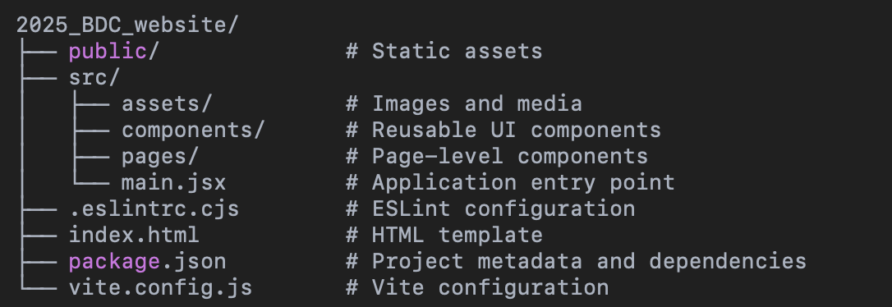

# 2025_BDC_website

This is the official frontend codebase for the **2025 BioDesign Challenge** website, developed by the Petrichor team. Built with **React** and **Vite**, this project emphasizes performance, scalability, and developer experience.

## 🔧 Tech Stack

- **React** – Declarative UI library for building user interfaces
- **Vite** – Lightning-fast build tool and development server
- **ESLint** – Linting for code quality and consistency
- **Node.js** – JavaScript runtime environment
- **Docker** - Containerization for consistent deployment
- **TensorFlow.js** - AI-powered clothing color changing functionality

---

## 🚀 Getting Started

Follow the steps below to clone, set up, and run the project locally.

### Option 1: Standard Setup

#### 1. Clone the repository

```bash
git clone https://github.com/powei05/2025_BDC_website.git
```

#### 2. Navigate into the project folder

```bash
cd 2025_BDC_website
```

#### 3. Install Node.js (if you haven't already)

You can download Node.js from the official website: https://nodejs.org

#### 4. Verify Node.js installation

```bash
node -v
```

#### 5. Install project dependencies

```bash
npm install
```

This command installs all necessary packages defined in package.json.

#### 6. Start the development server

```bash
npm run dev
```

Once the server is running, open your browser and go to:

```bash
http://localhost:5173
```

### Option 2: Docker Setup

#### 1. Clone the repository

```bash
git clone https://github.com/powei05/2025_BDC_website.git
cd 2025_BDC_website
```

#### 2. Build and run with Docker

```bash
# Build the Docker image
docker build -t bdc25-website .

# Run the container
docker run -p 80:80 bdc25-website
```

Access the application at http://localhost:80

## 📁 Project Structure



## 🔍 Key Features

- **Responsive Design**: Optimized for desktop and mobile devices
- **Clothing Color Changer**: AI-powered feature that changes clothing colors in real-time

## 👥 Maintainers

This project is maintained by the Petrichor Consulting Co., Ltd.
For any issues or contribution inquiries, please open an issue on GitHub or contact the team.
